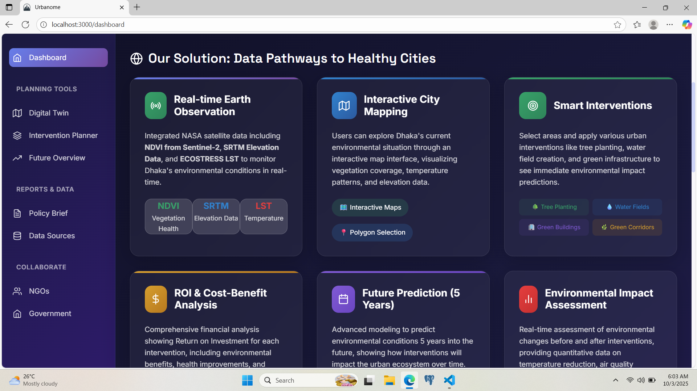

# Data Pathways to Healthy Cities and Human Settlement
## NASA Space Apps Challenge 2025

### 🌍 Project Overview
A comprehensive urban planning application that leverages NASA Earth observation data to develop smart strategies for sustainable city growth while maintaining the wellbeing of people and the environment.

### 🎯 Challenge Description
Climate change brings new complexities to maintaining society and environmental wellbeing in cities. This project demonstrates how urban planners can use NASA Earth observation data to develop smart strategies that balance human quality of life with environmental sustainability.

### 📊 Dashboard




### 🚀 Key Features

#### 1. City Digital Twin
- **Heat Monitoring**: ECOSTRESS Land Surface Temperature
- **Flood Risk Assessment**: SRTM elevation Data
- **Air Quality Tracking**: OpenAQ Air Quality Data
- **Green Space Analysis**: Sentinel-2 NDVI vegetation indices
  

  
#### 2. Intervention Simulator
- **Tree Planting**: Impact on urban heat island effect
- **Cool Roofs**: Temperature reduction modeling
- **Wetlands Creation**: Flood mitigation and biodiversity
- **Green Corridors**: Air quality improvement

#### 3. Cost-Benefit Analysis
- Budget-constrained optimization
- ROI calculations for interventions
- Environmental impact quantification
- Social benefit metrics

#### 4. Future Overview
- **Greenspace Analysis**: Forecasting the percentage of greenspace (grasses and trees) for the next five years using regression models. The analysis is based on multi-temporal GeoTIFF images (1990–2025) obtained from Landsat 5, 7, and 8 satellites.  
- **Rainfall and Windspeed**: Estimating future average annual rainfall and windspeed using a polynomial regression model trained on 17 years of historical climate data.  
- **Temperature**: Predicting future average annual temperature by incorporating 17 years of historical temperature, rainfall, and windspeed data into a regression model. The predicted rainfall and windspeed values are also used as key predictors in the temperature model for improved accuracy.

### 📊 NASA Data Sources
- **ECOSTRESS**: Land Surface Temperature for heat mapping
- **Sentinel-2**: Normalized Difference Vegetation Index for green space analysis
- **SRTM**: Shuttle Radar Topography Mission elevation data
- **OpenAQ**: Air quality measurements

### 🌐Data Sources Details
- **ECOSTRESS**: The ECOsystem Spaceborne Thermal Radiometer Experiment on Space Station, a NASA mission mounted on the International Space Station (ISS). It measures surface temperature to study plant water use, heat stress, and impacts of climate variability.
- **Sentinel-2**: An Earth observation mission of the European Space Agency (ESA) under the Copernicus Programme. While developed and operated by ESA, NASA contributes through ground station support, global data distribution, and collaborative research efforts.
- **SRTM**: The Shuttle Radar Topography Mission, a joint project of NASA and the National Geospatial-Intelligence Agency (NGA). Flown aboard the Space Shuttle Endeavour in 2000, it collected near-global digital elevation data to create one of the most complete high-resolution topographic databases of Earth.
- **OpenAQ**: A global open-source air quality platform providing real-time and historical data. It aggregates measurements of pollutants such as PM2.5, PM10, NO₂, O₃, CO, and others from monitoring stations worldwide to support research, policy, and public awareness.  
  
### 🛠 Tech Stack
- **Frontend**: React.js with modern hooks and context
- **Backend**: Express.js with RESTful APIs
- **Maps**: Leaflet.js for interactive mapping
- **Visualization**: Chart.js and D3.js for data visualization
- **Data Processing**: Python scripts for NASA data ingestion

### 🏗 Project Structure
```
nasa-healthy-cities/
├── client/                 # React frontend
├── server/                 # Express backend
├── data-processing/        # Python NASA data processors
```

### 🌟 Deliverables
1. **Interactive City Dashboard**: Real-time environmental monitoring
2. **Intervention Planning Tool**: Scenario modeling and simulation
3. **Future Overview**: Prediction of greenspace percentage, rainfall, windspeed and temperature using previous years data.
4. **Cost-Benefit Calculator**: Economic impact assessment

### 🌏 Focus Areas
- **Dhaka, Bangladesh**: Comprehensive studies on greenspace distribution, heat stress, flood risk, and air quality within Dhaka District. These analyses aim to support sustainable urbanization, guide intervention planning, project future environmental scenarios, and conduct cost–benefit evaluations for informed decision-making.

### 📈 Impact Metrics
- Urban Heat Island reduction
- Flood risk mitigation percentage
- Air quality improvement indices
- Green space coverage increase
- Economic ROI of interventions

---

Built for NASA Space Apps Challenge 2025
