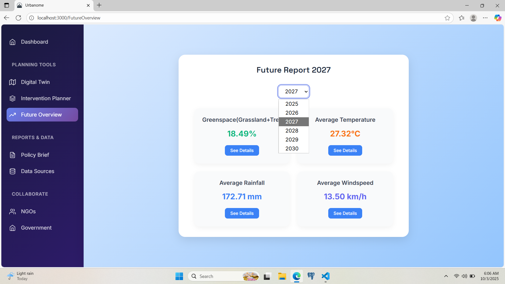
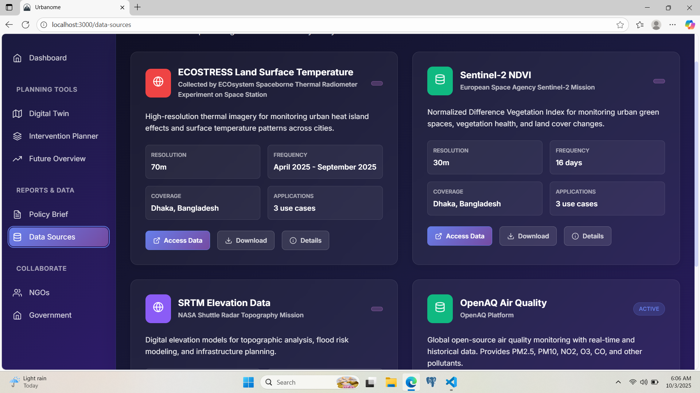

# Data Pathways to Healthy Cities and Human Settlement
## NASA Space Apps Challenge 2025

### 🌍 Project Overview
A comprehensive urban planning application that leverages NASA Earth observation data to develop smart strategies for sustainable city growth while maintaining the wellbeing of people and the environment. This tool that allows users to simulate environmental actions — such as planting trees or creating waterfields — to improve urban sustainability. It visualizes the current environmental conditions of Dhaka on an interactive map and projects both financial and ecological outcomes over the next 15 years using our custom ROI calculation algorithm. Additionally, the system’s AI model predicts key environmental metrics for the next 5 years, helping policymakers and communities make informed, data-driven decisions.

### 🎯 Challenge Description
Dhaka, one of the fastest-growing megacities, faces rising temperatures, air pollution, flooding, and unplanned urbanization. Despite the availability of rich NASA Earth observation data, policymakers and communities struggle to translate this data into actionable strategies. There is no accessible tool that shows the long-term financial and environmental impact of urban interventions — such as tree planting or water management — in a way that supports sustainable planning and resilience building.

#### 🚀 Live Web Application

https://urbanome-xi.vercel.app

### 📊 Dashboard


### 🚀 Key Features

#### 1. City Digital Twin
- **Heat Monitoring**: ECOSTRESS Land Surface Temperature
- **Flood Risk Assessment**: SRTM elevation Data
- **Air Quality Tracking**: OpenAQ Air Quality Data
- **Green Space Analysis**: Sentinel-2 NDVI vegetation indices
#### Greenspace Section Demo:  

  
#### 2. Intervention Simulator
- **Tree Planting**: Impact on urban heat island effect
- **Cool Roofs**: Temperature reduction modeling
- **Wetlands Creation**: Flood mitigation and biodiversity
- **Green Corridors**: Air quality improvement


#### 3. Cost-Benefit Analysis
- Budget-constrained optimization
- ROI calculations for interventions
- Environmental impact quantification
- Social benefit metrics
  


#### 4. Future Overview
- **Greenspace Analysis**: Forecasting the percentage of greenspace (grasses and trees) for the next five years using regression models. The analysis is based on multi-temporal GeoTIFF images (1990–2025) obtained from Landsat 5, 7, and 8 satellites.  
- **Rainfall and Windspeed**: Estimating future average annual rainfall and windspeed using a polynomial regression model trained on 17 years of historical climate data.  
- **Temperature**: Predicting future average annual temperature by incorporating 17 years of historical temperature, rainfall, and windspeed data into a regression model. The predicted rainfall and windspeed values are also used as key predictors in the temperature model for improved accuracy.



### 📊 NASA Data Sources
- **ECOSTRESS**: Land Surface Temperature for heat mapping
- **Sentinel-2**: Normalized Difference Vegetation Index for green space analysis
- **SRTM**: Shuttle Radar Topography Mission elevation data
- **OpenAQ**: Air quality measurements

### 🚀 Usage of AI
- Coding: GPT 5.1, Claude 4.0
- Research: ChatGPT

### 🌟 ROI Calculation Algorithm Data Sources [ Modified for Dhaka ]

- Wu, S., Yang, H., Luo, P., Luo, C., Li, H., Liu, M., Ruan, Y., Zhang, S., Xiang, P., Honghong, J., & Yue, C. (2021). The effects of the cooling efficiency of urban wetlands in an inland megacity: A case study of Chengdu, Southwest China. Building and Environment, 108128.
https://doi.org/10.1016/j.buildenv.2021.108128
        
- Feng, X., Yu, J., Xin, C., Ye, T., Wang, T., Chen, H., Zhang, X., & Zhang, L. (2023). Quantifying and Comparing the Cooling Effects of Three Different Morphologies of Urban Parks in Chengdu. Land, 12(2), 451.
https://doi.org/10.3390/land12020451

- Wong, N. H., Tay, S. F., Wong, R., Ong, C. L., & Sia, A. (2003). Life cycle cost analysis of rooftop gardens in Singapore. Building and Environment, 38(3), 499-509.
https://doi.org/10.1016/S0360-1323(02)00131-2

- Hsu, K.-W., & Chao, J.-C. (2020). Economic Valuation of Green Infrastructure Investments in Urban Renewal: The Case of the Station District in Taichung, Taiwan. Environments, 7(8), 56.
https://doi.org/10.3390/environments7080056
   

  
### 🛠 Tech Stack
- **Frontend**: React.js with modern hooks and context
- **Backend**: Express.js with RESTful APIs
- **Maps**: Leaflet.js for interactive mapping
- **Visualization**: Chart.js for data visualization
- **Data Processing**: Python scripts for NASA data ingestion

### 🏗 Project Structure
```
nasa-healthy-cities/
├── client/                 # React frontend
├── server/                 # Express backend
├── data-processing/        # Python NASA data processors
```

### 🌟 Deliverables
1. **Interactive City Dashboard**: Real-time environmental monitoring
2. **Intervention Planning Tool**: Scenario modeling and simulation
3. **Future Overview**: Prediction of greenspace percentage, rainfall, windspeed and temperature using previous years data.
4. **Cost-Benefit Calculator**: Economic impact assessment

### 🌏 Focus Areas
- **Dhaka, Bangladesh**: Comprehensive studies on greenspace distribution, heat stress, flood risk, and air quality within Dhaka District. These analyses aim to support sustainable urbanization, guide intervention planning, project future environmental scenarios, and conduct cost–benefit evaluations for informed decision-making.

### 📈 Impact Metrics
- Urban Heat Island reduction
- Flood risk mitigation percentage
- Air quality improvement indices
- Green space coverage increase
- Economic ROI of interventions

---

Built for NASA Space Apps Challenge 2025
